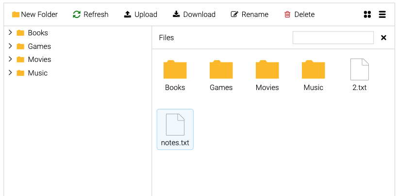

<div id="top"></div>
<br />
<div align="center">
  <a href="https://github.com/GuilleLegend">
    
  </a>

  <h1 align="center">Artemis Code File Explorer Component</h1>

  <p align="center">
    Lightweight and easy-to-use Angular File Explorer module
    <br />
    <a href="https://artemnih.github.io/ngx-explorer/"><strong>Demo »</strong></a>
    <br />
    <br />    
            <p align="center">Web:<a href="https://artemiscode.es"><strong>ArtemisCode</strong></a></p>
  </p>
</div>


## Setup
- Install package 
```
npm i ngx-explorer
```
- Implement `IDataService` provider interface
```Typescript
import { IDataService } from 'ngx-explorer';

export class MyDataService implements IDataService<MyNodeType> {
    ... 
}
```
- Add `NgxExplorerModule` and data provider to `NgModule`
```Typescript
import { NgxExplorerModule, DataService } from 'ngx-explorer';

@NgModule({
    imports: [
        ...
        NgxExplorerModule
    ],
    providers: [
        { provide: DataService, useClass: MyDataService }
    ]
})
export class AppModule { }
```
- Add `<nxe-explorer></nxe-explorer>` to the template
- Add css import `@import '~ngx-explorer/src/assets/icons/css/nxe.css'`


## Contributing
Contributions are what make the open source community such an amazing place to learn, inspire, and create. Any contributions you make are greatly appreciated.

If you have a suggestion that would make this better, please fork the repo and create a pull request. You can also simply open an issue with the tag "enhancement".

1. Fork the Project
2. Create your Feature Branch (`git checkout -b feature/AmazingFeature`)
3. Commit your Changes (`git commit -m 'Add some AmazingFeature'`)
4. Push to the Branch (`git push origin feature/AmazingFeature`)
5. Open a Pull Request

## About
This project was initially a fork from `ngx-explorer`, which I extended with additional properties and adapted to a project I was developing in `Supabase`. However, due to the many added features and changes, we decided to maintain it separately. Feel free to grow this Open Source Community.